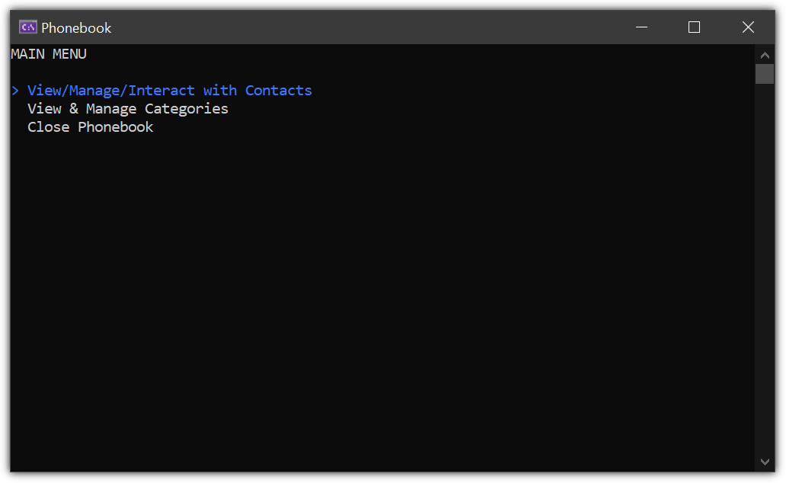

# Phonebook

The [Phonebook](https://www.thecsharpacademy.com/project/16/phonebook) project is the first project I've done using Entity Framework. EF made working with the database much simpler and required significantly fewer lines of code. The coolest part of the project is that it is able to send email and SMS messages. Doing those two things also made me learn about using environment variables so things like passwords and API keys are not public. The method for sending SMS also gave me more practice using async/await. For sending SMS messages, I used [Textbelt](https://textbelt.com/). This project is part of [The C# Academy](https://www.thecsharpacademy.com/) curriculum.

## Requirements

- [x] This is an application where you should record contacts with their phone numbers.
- [x] Users should be able to Add, Delete, Update and Read from a database, using the console.
- [x] You need to use Entity Framework, raw SQL isn't allowed.
- [x] Your code should contain a base Contact class with AT LEAST {Id INT, Name STRING, Email STRING and Phone Number(STRING)}
- [x] You should validate e-mails and phone numbers and let the user know what formats are expected
- [x] You should use Code-First Approach, which means EF will create the database schema for you.
- [x] You should use SQL Server, not SQLite.

## Challenges

- [x] Create a functionality that allows users to add the contact's email address and send an email message from the app.
- [x] Expand the app by creating categories of contacts (i.e. Family, Friends, Work, etc).
- [x] What if you want to send not only emails but SMS?

## Setting Up Email Credentials
This app requires environment variables for sending emails.  
Before running, set your own credentials.

For example:

**Windows (Command Prompt)**
```sh
setx EMAIL_ADDRESS "your_email@gmail.com"
setx EMAIL_APP_PASSWORD "your_app_password"
```
## Setting Up SMS API Key
This app requires an environment variable for sending SMS texts.
Before running, set your API key to the following:

`TEXTBELT_API_KEY = "textbelt"`

The `textbelt` API key allows you to send 1 free text per day. [Create your own key](https://textbelt.com/purchase/?generateKey=1) to send more messages.

